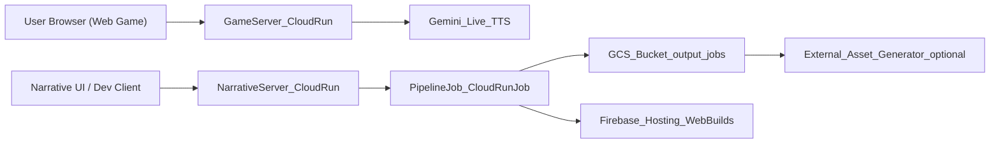

## Narrative Engine — Gemini Live Creative Storyteller

**From plain text story to a playable 3D world with live, multimodal narration.**  
You write a story → the system turns it into a narrative spec and world graph → builds a Godot 3D world → adds generated sky, images, voiceover, and background music → serves it through a Gemini-powered game server on Google Cloud.

This project is built for the **Gemini Live Agent Challenge – Creative Storyteller** track. It demonstrates **multimodal, interleaved output** (text + images + audio) and a **cloud-native agent architecture** using **Vertex AI (Gemini, Imagen, Gemini-TTS, Lyria)** and **Cloud Run**.

---

### Table of Contents

- **What this project does**
- **System architecture (high level)**
- **Tech stack**
- **Repository layout**
- **Local setup & “hello world” run**
- **Live game + NPC dialogue (local)**
- **Cloud deployment & automation (Google Cloud)**
- **Hackathon demo script (recommended flow)**
- **Hackathon submission checklist**
- **Advanced topics (assets & web hosting)**
- **Environment variables**
- **License**

---

## What this project does

- **Story → 3D world**: Converts a plain text story into a structured narrative spec, world plan, and world graph.
- **Procedural level design**: Uses Gemini to design areas, gates, spawn points, and entity layouts (NPCs, props, key items).
- **Multimodal generation**:
  - **Imagen**: generates sky domes and optional asset reference images.
  - **Gemini-TTS + Lyria**: generates emotional narration and ambient background music.
- **Godot 4 web game**: Renders the world as a first-person 3D experience, exported as HTML5/WASM.
- **Gemini-powered game server**:
  - Serves world data (`game_bundle.json`) and runtime config.
  - Generates **live NPC dialogue + TTS audio** via Gemini (Live/streaming) when players interact.
- **Cloud-native orchestration**:
  - Cloud Run + Cloud Run Jobs for the pipeline.
  - GCS (and optionally Firebase Hosting) for web builds.
  - Optional external 3D asset generator integration for long-running asset generation.

This aligns with the **Creative Storyteller** category by weaving text, images, and audio into a cohesive, playable narrative that is generated end-to-end by Gemini.

---

## System architecture (high level)

At a high level, the system looks like this:



- **User Browser (web game)**: Loads the exported Godot web build and calls the game server for dialogue.
- **GameServer (Cloud Run, `game_server/`)**: FastAPI service that serves `game_bundle` (from local disk or GCS) and handles `/api/dialogue_turn` + `/api/chat` via Gemini (Live TTS for NPCs).
- **NarrativeServer (Cloud Run, `narrative_server/`)**: Accepts a story via POST `/generate`, writes it to GCS, starts the pipeline Cloud Run Job, and exposes job status via `/jobs/<job_id>`.
- **PipelineJob (Cloud Run Job, `pipeline_job/`)**: Runs `run_world_pipeline.sh` in a container (including Godot export), writes outputs and web build to GCS, and (optionally) deploys to Firebase Hosting.
- **GCS bucket**: Persistent storage for `output_jobs/<job_id>/` (narrative spec, game bundle, audio, web export).
- **Firebase Hosting (optional)**: Global static hosting for the exported web games (one path per job).

See **[docs/GCP_DEPLOY.md](docs/GCP_DEPLOY.md)** and **[docs/CLOUD_WEB_HOSTING.md](docs/CLOUD_WEB_HOSTING.md)** for more detailed deployment diagrams and flows.

---

## Tech stack

- **Language & runtime**
  - Python 3.10+
  - FastAPI (for `game_server`, `narrative_server`, `cloud_run_agent`)
- **Game engine**
  - Godot 4.x (Web export)
- **Google Cloud**
  - Vertex AI:
    - Gemini 2.x (narrative spec, world layout, NPC dialogue, vision)
    - Imagen 3 (sky + asset images)
    - Gemini-TTS (voiceover)
    - Lyria 2 (BGM)
  - Cloud Run (game server, narrative server, optional Live agent)
  - Cloud Run Jobs (full pipeline)
  - Cloud Storage (pipeline output + web assets)
  - Optional Firebase Hosting (static web games)

---

## Repository layout

From `Narrative_Engine/`:

- **Core pipeline**
  - `run_world_pipeline.sh` – main story → world → game → audio → export pipeline.
  - `generate_narrative_spec.py` – converts raw story into a structured narrative spec.
  - `narrative_spec_to_world.py`, `world_block_diagram.py`, `compute_spawn_point.py`, `world_entity_layout_llm_v3.py` – world plan, layout, geometry, spawn, and entity placement.
  - `generate_3d_asset_prompts.py`, `generate_sky_image.py`, `build_game_bundle.py`, `generate_audio.py` – multimodal generation (asset prompts, sky, bundle, audio).
  - `export_godot.sh`, `stage_and_export_story.sh` – stage assets into Godot and export web build.
- **Services**
  - `game_server/` – FastAPI game + dialogue server (Cloud Run friendly, has its own `Dockerfile`).
  - `narrative_server/` – FastAPI narrative orchestration server for `/generate` and `/jobs/<job_id>`.
  - `cloud_run_agent/` – Gemini Live / interleaved-output agent for narrative interactions (Cloud Run deployable).
  - `live_npc_agent/` – real-time NPC voice agent logic (Gemini Live, TTS integration with the game).
- **Cloud pipeline**
  - `pipeline_job/` – Dockerfile and entrypoint for the Cloud Run Job that runs the full pipeline in GCP.
  - `cloudbuild-game-server.yaml`, `cloudbuild-narrative-server.yaml`, `cloudbuild-pipeline-job.yaml` – Cloud Build configs to build and push images.
- **Game content**
  - `godot_world/` – Godot 4 project with scripts, scenes, UI (`scripts/audio_manager.gd`, `scripts/ui/compass_hud.gd`, etc.).
  - `output/`, `output_jobs/` – local pipeline outputs (timestamps and job IDs).
- **Docs & config**
  - `docs/` – deployment guides and hosting strategies.
  - `firebase.json` (at repo root) – Firebase Hosting config when used.
  - `requirements.txt`, `game_server/requirements.txt`, `narrative_server/requirements.txt` – Python dependencies.

Large generated assets (`output/`, `output_jobs/`, generated GLBs, audio) are **not meant to be committed**; they are reproducible from the pipeline.

---

## Local setup & “hello world” run

### 1. Prerequisites

- **Python**: 3.10 or newer.
- **Godot**: 4.x with **Web export templates** installed (Editor → Manage Export Templates → install Web).
- **Google Cloud**:
  - A project with **Vertex AI** and **Cloud Storage** enabled and billing turned on.
  - `gcloud` CLI installed and authenticated.

Run once:

```bash
gcloud auth application-default login
```

Set your own project and region (replace with your IDs – values below are examples):

```bash
export GOOGLE_CLOUD_PROJECT=your-gcp-project-id
export GOOGLE_CLOUD_LOCATION=us-central1
```

### 2. Create and activate virtualenv

```bash
cd Narrative_Engine
python3 -m venv venv
source venv/bin/activate   # Windows: venv\Scripts\activate
pip install --upgrade pip
pip install -r requirements.txt \
  -r game_server/requirements.txt \
  -r narrative_server/requirements.txt
```

**Every new terminal:**

```bash
cd Narrative_Engine
source venv/bin/activate
```

### 3. Create a simple story

Create `story.txt` in `Narrative_Engine/` (or use `story_new_game.txt` as a starting point):

```text
You wake up on a foggy island with three mysterious NPCs, each guarding a fragment of a broken lighthouse lens. 
To restore the light, you must explore the island, solve small tasks, and decide who to trust.
```

### 4. Run the full pipeline locally (inside venv)

In a terminal where your virtualenv is already active:

```bash
cd Narrative_Engine
./run_world_pipeline.sh story.txt
```

This will:

- Generate a narrative spec, world plan, entity layout.
- Generate 3D asset briefs and a sky image.
- Build `game_bundle.json`.
- Generate voiceover + BGM by default (Gemini-TTS + Lyria).
- Export a **web build** to `output/<timestamp>/export/web/`.

### 5. Serve and play the web build locally

```bash
cd output/<timestamp>/export/web
python3 -m http.server 8080
```

Open `http://localhost:8080` in your browser to play the generated world.

---

## Live game + NPC dialogue (local)

To showcase the **live agent** behavior (NPC dialogue powered by Gemini and TTS), in a terminal where your virtualenv is active:

```bash
cd Narrative_Engine
# Make sure GAME_OUTPUT points to the latest pipeline output
GAME_OUTPUT=output/<timestamp> ./run_game.sh --godot
```

This will:

- Start the **game server** (FastAPI) locally.
- Launch the Godot client pointing at the right `GAME_OUTPUT`.
- Let you walk around, talk to NPCs, and hear **Gemini-generated lines spoken via TTS** in real time.

By default, pipeline narrative generation uses `GEMINI_MODEL` (e.g. `gemini-2.5-pro`), and in-game NPC dialogue uses `GEMINI_NPC_MODEL` (flash/low-latency).

You can override:

```bash
export GEMINI_MODEL=gemini-2.5-pro
export GEMINI_NPC_MODEL=gemini-2.5-flash
```

---

## Cloud deployment & automation (Google Cloud)

This project is designed to be **scriptable and reproducible** on GCP. The main automation pieces are:

- **Cloud Run services**:
  - `narrative-game-server` (from `game_server/`).
  - `narrative-server` (from `narrative_server/`).
  - `narrative-agent` (from `cloud_run_agent/`, optional Live/Creative agent).
- **Cloud Run Job**:
  - `narrative-pipeline-job` (from `pipeline_job/`).
- **Cloud Build**:
  - `cloudbuild-game-server.yaml`, `cloudbuild-narrative-server.yaml`, `cloudbuild-pipeline-job.yaml` to build and push Docker images.
- **Storage & Hosting**:
  - GCS bucket for `output_jobs/<job_id>/`.
  - Optional Firebase Hosting to serve the web build at `https://<project>.web.app/<job_id>/`.

### 1. Create a GCS bucket

Example (see **[docs/GCP_DEPLOY.md](docs/GCP_DEPLOY.md)** for more details):

```bash
export GOOGLE_CLOUD_PROJECT=your-gcp-project-id
export GOOGLE_CLOUD_LOCATION=us-central1
export GCS_BUCKET="${GOOGLE_CLOUD_PROJECT}-narrative-output"

gcloud storage buckets create "gs://${GCS_BUCKET}" \
  --project="${GOOGLE_CLOUD_PROJECT}" \
  --location="${GOOGLE_CLOUD_LOCATION}"
```

### 2. Deploy the game server (Cloud Run)

Build and deploy (from repo root so the Dockerfile can copy the project). You can run these either inside or outside the Python virtualenv, but staying in the same activated shell is fine:

```bash
cd Narrative_Engine

docker build -f game_server/Dockerfile \
  -t gcr.io/${GOOGLE_CLOUD_PROJECT}/narrative-game-server .
docker push gcr.io/${GOOGLE_CLOUD_PROJECT}/narrative-game-server

gcloud run deploy narrative-game-server \
  --image gcr.io/${GOOGLE_CLOUD_PROJECT}/narrative-game-server \
  --region "${GOOGLE_CLOUD_LOCATION}" \
  --platform managed \
  --set-env-vars "GCS_BUCKET=${GCS_BUCKET},GOOGLE_CLOUD_PROJECT=${GOOGLE_CLOUD_PROJECT},GOOGLE_CLOUD_LOCATION=${GOOGLE_CLOUD_LOCATION}" \
  --allow-unauthenticated
```

After deployment, note the URL, for example:

```text
https://narrative-game-server-xxxx-uc.a.run.app
```

Use this as `CHAT_API_BASE` for the pipeline and narrative server.

### 3. Deploy the narrative server (Cloud Run)

In a shell where you’ve already exported your env vars (can be the same venv shell):

```bash
cd Narrative_Engine/narrative_server

gcloud run deploy narrative-server --source . \
  --region "${GOOGLE_CLOUD_LOCATION}" \
  --set-env-vars "GCS_BUCKET=${GCS_BUCKET},GOOGLE_CLOUD_PROJECT=${GOOGLE_CLOUD_PROJECT},GOOGLE_CLOUD_LOCATION=${GOOGLE_CLOUD_LOCATION},PIPELINE_JOB_NAME=narrative-pipeline-job,PIPELINE_JOB_REGION=${GOOGLE_CLOUD_LOCATION},CHAT_API_BASE=https://narrative-game-server-xxxx-uc.a.run.app" \
  --allow-unauthenticated
```

The narrative server exposes:

- `POST /generate` – submit a story; uploads to GCS and starts the Cloud Run Job.
- `GET /jobs/<job_id>` – poll for status, returns `game_url` or `error` when done.

### 4. Build and create the pipeline job (Cloud Run Job)

From `Narrative_Engine/` (again, an activated venv shell is fine, but not required for Docker/gcloud themselves):

```bash
cd Narrative_Engine

docker build -f pipeline_job/Dockerfile \
  -t gcr.io/${GOOGLE_CLOUD_PROJECT}/narrative-pipeline-job .
docker push gcr.io/${GOOGLE_CLOUD_PROJECT}/narrative-pipeline-job
```

Create the Cloud Run Job (once):

```bash
gcloud run jobs create narrative-pipeline-job \
  --image gcr.io/${GOOGLE_CLOUD_PROJECT}/narrative-pipeline-job \
  --region ${GOOGLE_CLOUD_LOCATION} \
  --set-env-vars "GCS_BUCKET=${GCS_BUCKET},GOOGLE_CLOUD_PROJECT=${GOOGLE_CLOUD_PROJECT},GOOGLE_CLOUD_LOCATION=${GOOGLE_CLOUD_LOCATION},CHAT_API_BASE=https://narrative-game-server-xxxx-uc.a.run.app" \
  --task-timeout 3600 \
  --max-retries 0
```

The job:

- Reads `story_input.txt` from `gs://${GCS_BUCKET}/output_jobs/${JOB_ID}/`.
- Runs the full pipeline (`run_world_pipeline.sh`, including Godot export).
- Uploads results and web build to `gs://${GCS_BUCKET}/output_jobs/${JOB_ID}/`.
- (Optionally) deploys to Firebase Hosting and writes `game_url.txt`.

See **[pipeline_job/README.md](pipeline_job/README.md)** for more details.

### 5. (Optional) Deploy the Live narrative agent (Cloud Run)

The `cloud_run_agent/` directory contains an **interleaved-output Gemini agent** (text + images + audio) that you can deploy as a standalone Live API backend:

```bash
cd Narrative_Engine/cloud_run_agent

gcloud run deploy narrative-agent --source . \
  --region "${GOOGLE_CLOUD_LOCATION}" \
  --service-account YOUR_SA@${GOOGLE_CLOUD_PROJECT}.iam.gserviceaccount.com
```

The service account needs **Vertex AI User** permissions. Set `GOOGLE_CLOUD_PROJECT` and `GOOGLE_CLOUD_LOCATION` on the service. This agent can be used for companion UIs in your demo (e.g., scripting stories or explaining the world).

### 6. (Optional) Firebase Hosting for web builds

For a CDN-backed static hosting setup with a single URL per game:

- Configure Firebase Hosting (see **[docs/CLOUD_WEB_HOSTING.md](docs/CLOUD_WEB_HOSTING.md)**).
- Have the pipeline job or a downstream step deploy `export/web/` for each job under:
  - `/<job_id>/` on `https://<project-id>.web.app`.
- The game link returned by `/jobs/<job_id>` is then:
  - `https://<project-id>.web.app/<job_id>/`.

---

## Hackathon submission checklist

Use this as a quick checklist before you submit on Devpost:

- **Code & README**
  - Public GitHub repo with this README at `Narrative_Engine/`.
  - `requirements.txt` and service-specific requirements checked in.
  - No secrets or private keys committed (only example project IDs).
- **Reproducible local run**
  - `run_world_pipeline.sh` works with a small `story.txt`.
  - Web build in `output/<timestamp>/export/web/` can be served locally.
  - `run_game.sh --godot` works with `GAME_OUTPUT=output/<timestamp>`.
- **Cloud deployment**
  - `narrative-game-server` deployed on Cloud Run (URL noted).
  - `narrative-server` deployed on Cloud Run with `PIPELINE_JOB_NAME` and `GCS_BUCKET` set.
  - `narrative-pipeline-job` created as a Cloud Run Job and run at least once end-to-end.
  - GCS bucket created and populated at `gs://${GCS_BUCKET}/output_jobs/<job_id>/`.
  - (Optional) Firebase Hosting serving `/<job_id>/` game URLs.
- **Proof of Google Cloud usage**
  - Short screen recording showing:
    - Cloud Run services and job running in the Google Cloud Console, and/or
    - Logs for a `narrative-pipeline-job` execution.
  - In the README / Devpost description, point to:
    - `gemini_client.py` (Vertex usage),
    - `generate_audio.py` (TTS + BGM),
    - `game_server/main.py` (NPC dialogue endpoints),
    - `pipeline_job/Dockerfile` + `pipeline_job` entrypoint (Cloud Run Job).
- **Demo video**
  - Follows (or is close to) the demo script above.
  - Clearly shows multimodal behavior (text + images + audio) and cloud deployment.

---

## Example hosted games (built from prompts)

These are example worlds already exported and hosted on Firebase from the pipeline. They are useful for judges to quickly understand the experience without waiting for a full pipeline run:

- **Ronin in the haunted mountain village**  
  Prompt:
  > You are a wandering ronin who enters a silent ancient Japanese village at sunset, where uneasy villagers speak in hushed voices and refuse to look toward the mountain shrine.  
  > As you move through the village and question each NPC, you hear of a missing priestess, ghostly footsteps in the bamboo forest, and a bell that rings each night for someone marked to disappear.  
  > Following their clues, you make your way to the shrine as the fog grows thicker and the village behind you falls completely still.  
  > There, beneath the bell, you find an old wooden tablet bearing your name—carved into it years before your birth.
  - Hosted build: [`https://project-363d072c-3554-4f41-b1e.web.app/20260316_045951/`](https://project-363d072c-3554-4f41-b1e.web.app/20260316_045951/)

- **Traveling merchant and the midnight bell**  
  Prompt:
  > You are a traveling merchant who arrives in a quiet 3D village at dusk, its streets strangely empty except for a few nervous villagers whispering about the old bell that rings at midnight with no one near it.  
  > As you walk through the village and speak to each NPC, their stories clash—one saw a shadow in the forest, another claims the mayor vanished, and a child insists the well in the square is calling names in the dark.  
  > Following their clues, you explore the village one last time until the bell tolls and every door suddenly swings open at once.  
  > At the center of the square, you realize the villagers were never warning you about the mystery—you were the final piece of it.
  - Hosted build: [`https://project-363d072c-3554-4f41-b1e.web.app/20260316_031843-local/`](https://project-363d072c-3554-4f41-b1e.web.app/20260316_031843-local/)

Architecture diagram used for the submission:


---

## Image & Asset workflows

### Optional: batch images for image-to-3D workflows

You can generate a batch of asset images for use with external image-to-3D services:

```bash
cd Narrative_Engine
source venv/bin/activate

python3 generate_asset_images_gemini.py \
  --prompts output/<run>/3d_asset_prompts.json \
  --out-dir output/<run>/assets_raw
```

These images can be used to drive your own asset pipelines.

### Optional: external 3D asset generator integration

When `/generate` runs in cloud mode (with `GCS_BUCKET` + `PIPELINE_JOB_NAME` set), the pipeline writes Phase 1 outputs to:

- `gs://$GCS_BUCKET/output_jobs/<job_id>/game_bundle.json`
- `gs://$GCS_BUCKET/output_jobs/<job_id>/3d_asset_prompts.json`

You can then call an **external 3D asset generator service** from your own tooling or job, using `3d_asset_prompts.json` as input, and have it write GLBs into a known location (for example, a folder like `generated_glbs/<job_id>/assets/`).

From there you can stage assets into Godot using the two-phase flow in  
**[docs/CLOUD_ASSETS_TWO_PHASE.md](docs/CLOUD_ASSETS_TWO_PHASE.md)** and `stage_and_export_story.sh`. Building orientation for buildings/NPCs uses `asset_metadata.json` (see `generate_asset_metadata_from_assets.py` and `godot_world/ORIENTATION.md`); set `GEMINI_MODEL` to a high-quality vision model (e.g. `gemini-2.5-pro`) for best results.

---

## Environment variables

| Variable | Purpose |
|----------|---------|
| `GOOGLE_CLOUD_PROJECT` | GCP project ID |
| `GOOGLE_CLOUD_LOCATION` | Vertex region (e.g. `us-central1`) |
| `GEMINI_MODEL` | Default narrative + planning model (e.g. `gemini-2.5-pro`). |
| `GEMINI_NPC_MODEL` | Live NPC dialogue model (default `gemini-2.5-flash` for low latency). |
| `GEMINI_IMAGE_MODEL` | Imagen model ID (default `imagen-3.0-generate-002`). |
| `LYRIA_MODEL` | Lyria model ID for BGM (default `lyria-002`). |
| `OUTPUT_DIR` / `GAME_OUTPUT` | Pipeline output directory and game runtime bundle path. |
| `GENERATE_AUDIO` | Default `1` (voiceover + BGM). Set to `0` to skip audio generation. |
| **`GCS_BUCKET`** | (Cloud) Bucket for `output_jobs/<job_id>/`; game server loads `game_bundle` from GCS when set. |
| **`CHAT_API_BASE`** | (Cloud) Game server URL for built games (e.g. `https://narrative-game-server-xxxx-uc.a.run.app`). |
| `PIPELINE_JOB_NAME` | (Cloud) Name of the Cloud Run Job used by the narrative server. |
| `PIPELINE_JOB_REGION` | (Cloud) Region of the Cloud Run Job. |

---

## License

MIT
